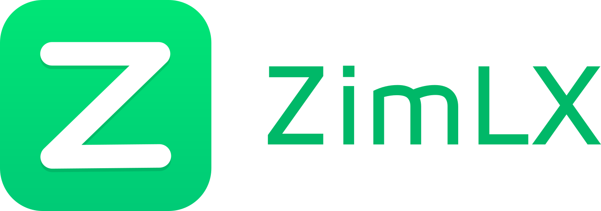

# ZimLX

<h1 align=center>

</h1>

Open Source and free Launcher for Android based on OpenLauncher.

## Screenshots
<table>
    <tr>
        <td>
        </td>
        <td>
        </td>
        <td>
                        </td>
    </tr>
    <tr>
            <td>
            </td>
            <td>
            </td><td>
                             </td>
        </tr>
    <tr>
        <td>
        </td>
        <td>
        </td>
        <td>
                        </td>
    </tr>
<table>

## Working Features
#### * Minibar
    -> Minibar custom color
    -> Minibar Edit items
   

#### * Desktop
    -> Row and Columns config
    -> Three indicator Style mode
    -> Full screen mode
    -> Background color
    
#### * Dock
    -> Dock Size
    -> Background Size

#### * App Drawer
    -> Row and Columns config
    -> Vertical and Horizontal Layout
    -> Four Sort Modes: AZ, ZA, Last Installed, Most Used (In vertical layout only AZ ZA are enabled) 
    -> Hide Apps
    -> Label Size
    -> Background color
    -> Scrollbar color
    -> Label Size
    -> Label color
    -> Cardview color

#### * Appearance
    -> Theme Color Change
    -> Theme Dark and Light
    -> Icon Size
    -> Icon Pack

#### * Folder
    -> Folder Shape
    -> Folder Background
    
#### * Gestures
    -> Gestures Config

#### * Notifications

## Future Features
* Desktop
    * Transitions
* App Drawer
    * Transitions
    * Badge support
    * Notifications
* Folder
    * Folder Preview
    * Folder Transition
* Appearance
    * Font Type
    * Font Size
* Multi language support and more cool stuff.

## Donations
Want to support me? https://paypal.me/saulhenriquez

## Collaborate
If you are interested in collaborate, please contact me at saul_henriquez@hotmail.com

For more information about OpenLauncher please visit https://github.com/OpenLauncherTeam
